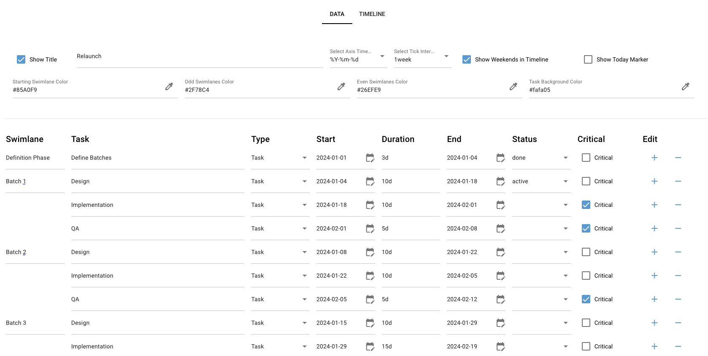
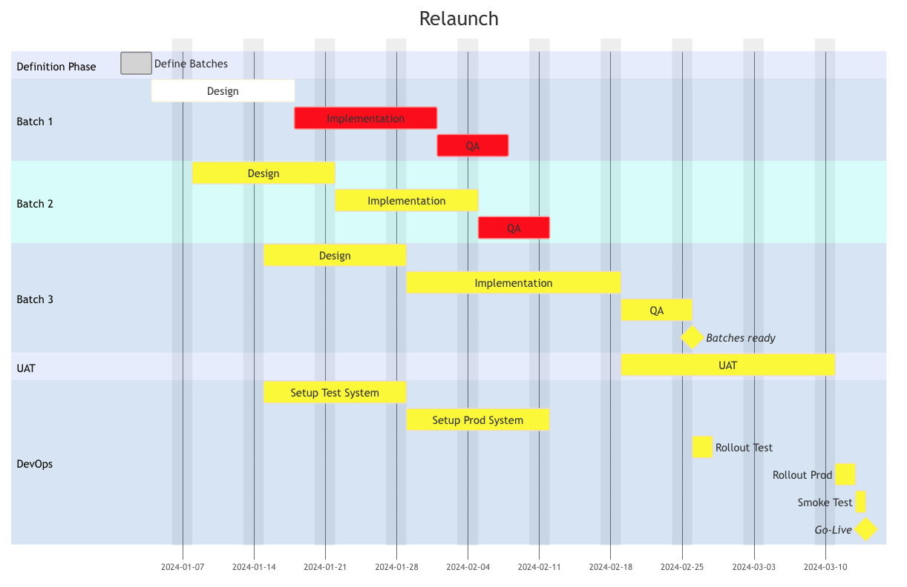

# Gladstone Gantter - a web application to draw Gantt Diagrams

Utlizing [Nicegui](https://nicegui.io/) and [Mermaid](https://mermaid.js.org/) 

* Editing Gantt Charts in a form based manner
* Entering start date and duration. End date will be calulated. Or overwrite the the end date
* Limited Color styling
* Loading and saving files to json to you local machine 
* Can be easly dockerized
## Example

## Result

## Setting up locally
1. Get the code from guthub
2. `conda env create -f env.yaml`
3. `conda activate gantt`
4. `python -m main.ui`

## Using the docker image

